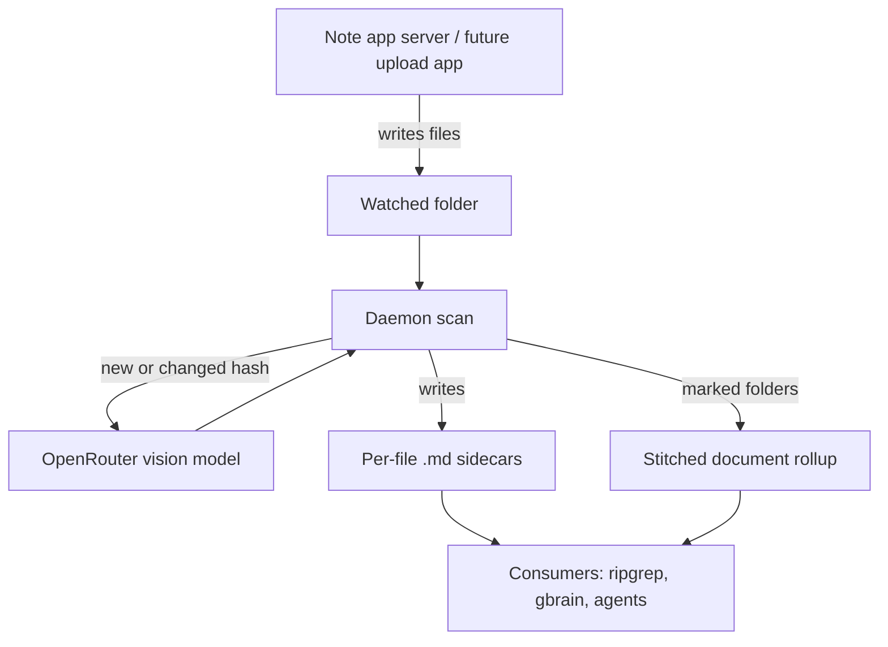

# Folder Transcription Daemon — Requirements

## Summary

A standalone daemon for the Linux server that monitors one configured folder for new and changed files and transcribes them into markdown via OpenRouter, writing a sidecar per file plus a stitched rollup for folders marked as documents. The note app's server keeps writing files; transcription responsibility moves out of it and into this daemon.

---

## Problem Frame

The note app's server backend currently performs transcription inline when notes arrive. Extracting that responsibility simplifies the server to "write the files" and makes transcription a reusable, standalone capability. The corpus is handwritten-note pages synced as PNGs, where a folder of page images represents one document — but the ambition is broader: a knowledge base where any file dropped into the folder (by sync today, by a quick upload app later) becomes markdown that agents and terminal search can consume. Instant searchability is not a hard requirement; flexibility and low operational fuss are.

---

## Key Decisions

- **Oneshot idempotent scan as the core; `--watch` as a thin optional wrapper.** One command walks the folder, diffs against recorded state, transcribes the delta, and exits. Cold-start backlog, scheduled runs, and manual runs are the same code path; the watcher mode just loops it. Crash-proof and testable first, low latency opt-in.
- **Per-file sidecars everywhere; rollups only for marked folders.** Generic output keeps the daemon useful for arbitrary future uploads. The notes-specific "folder = document" shape is layered on top via the existing convention: a folder is a document when its `index.md` contains a configurable marker.
- **OpenRouter as the API layer.** Transcription is a vision-capable chat model with a transcription prompt, not a provider-specific OCR endpoint. Swapping the base model is a config change.
- **Content-hash identity, not mtime.** Sync tools rewrite mtimes; the API costs money. A file's sha256 decides whether it has been transcribed.
- **All state lives inside the watched folder.** Ledger, raw responses, and logs sit in a dot-directory at the folder root, so a folder-scoped grant (OpenClaw workspace, Hermes filesystem path, the sync itself) covers the corpus and everything derived from it.
- **Named `transcriptd`, implemented in Rust.** A single static binary suits the systemd-timer deployment, and the name says what the tool does.

---

## Requirements

**Detection and state**

- R1. The daemon monitors one configured folder, recursively, for new and changed files.
- R2. A file whose content hash is already recorded as transcribed is never re-sent to the API, regardless of mtime or path changes.
- R3. All daemon state — hash ledger, retained raw responses, logs — lives in a dot-directory inside the watched folder.
- R4. Files still being written (mid-sync) are not transcribed until their content is stable; they are picked up on a later sweep.

**Transcription**

- R5. v1 transcribes images (png/jpg/webp), PDFs, and office/text documents into markdown. Unsupported types are logged as skipped, not treated as errors.
- R6. All transcription calls go through OpenRouter with the model named in config; changing models requires no code change.
- R7. The raw API response for every transcription is retained, so richer output schemas later need no re-transcription.

**Output contract**

- R8. Every transcribed file gets a markdown sidecar next to it, with frontmatter identifying the source file, its content hash, and the model and prompt version that produced it.
- R9. A folder whose `index.md` contains the configured marker is a document: the daemon maintains a stitched rollup markdown at its root, one section per transcribed file in filename order. Rollup regeneration reassembles cached per-file transcripts and makes no API calls.
- R10. A failed transcription never produces a sidecar — no empty or partial transcript is ever recorded as done.

**Operation**

- R11. Scheduled operation is a systemd timer (or cron) running the scan; an optional `--watch` mode wraps the same scan with a filesystem watcher for near-instant pickup.
- R12. Failed files are retried on subsequent sweeps, and repeated failures stay visible in the log or a status surface — never silently dropped.

---

## Acceptance Examples

- AE1. **Covers R2, R11.** Given a fully transcribed corpus, when the scheduled scan runs again with no file changes, then it exits having made zero API calls.
- AE2. **Covers R2, R8, R9.** Given a page PNG that is edited in the app and re-synced under the same filename, when the scan runs, then the new content hash triggers one transcription, the sidecar is replaced, and the document rollup is restitched.
- AE3. **Covers R4.** Given a large file mid-sync, when the scan encounters it, then it is skipped this sweep and transcribed on a later sweep once stable.
- AE4. **Covers R10, R12.** Given an OpenRouter error on one file, when the sweep completes, then that file has no sidecar, the failure is logged, and the next sweep retries it.
- AE5. **Covers R9.** Given a marked document folder that gains one new page, when the scan runs, then only that page is transcribed and the rollup is restitched from cache.
- AE6. **Covers R5.** Given a `.docx` landing in the folder, it is transcribed to markdown; given an unsupported `.xyz`, it is logged as skipped and the sweep continues.

---

## Success Criteria

- Text from a newly synced note is findable with `rg` against the folder within one scan interval.
- Re-running the scan over an unchanged corpus costs zero API spend.
- Swapping the transcription model touches configuration only.

---

## Scope Boundaries

- Search front-ends are consumers, not deliverables: ripgrep needs nothing built; gbrain ingestion and any MCP surface are separate efforts reading the same sidecars.
- No feedback channel to the note app's server. Its existing transcription pipeline stays untouched until the user chooses to retire it.
- Audio transcription is future work (different pipeline: speech model, not vision).
- The quick upload app is future work; this daemon is what makes it cheap later.

---

## Dependencies / Assumptions

- An OpenRouter account and API key; vision-capable models there accept image and PDF inputs. How office/text documents are handled (native model input vs a conversion step) is verified at planning.
- Filename sort equals page order inside a marked document folder (confirmed assumption from dialogue).
- The sync delivers whole files eventually, and partial files are detectable via a stability check (size/mtime settling). Unverified against the actual sync behavior.
- The `index.md`-with-marker convention already exists in the corpus and will continue.
- The target host is Linux with systemd.

---

## Outstanding Questions

**Deferred to planning**

- Stability-gate mechanics (settle time, recheck count).
- Office/text document conversion approach.
- Retry/backoff policy and what the status surface looks like.
- Config file format and location; ledger format (explicit index vs sidecar-presence).
- PDF page handling (split to images vs native PDF input) and rollup file naming.
